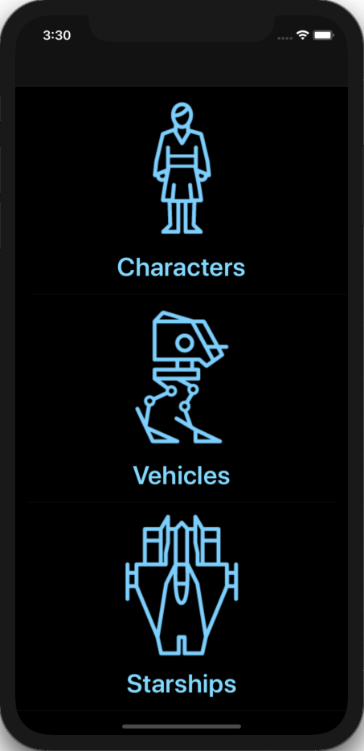
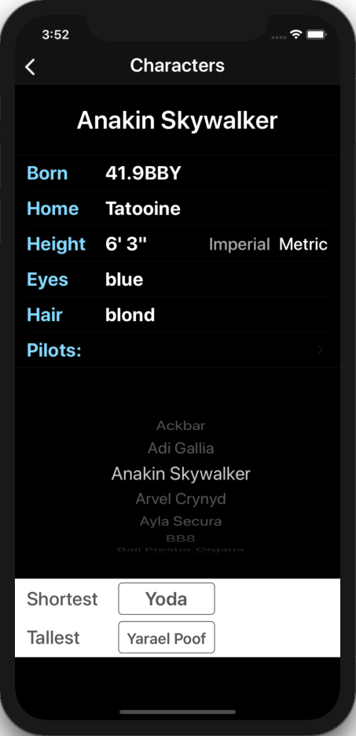
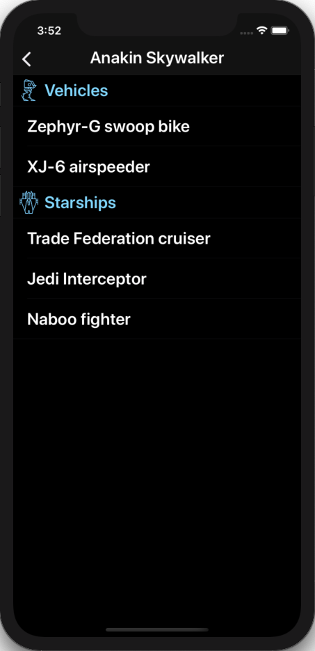
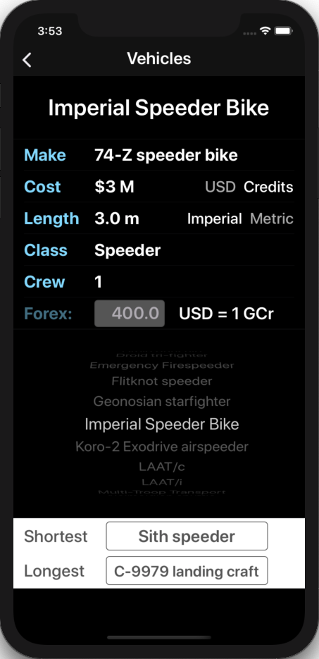
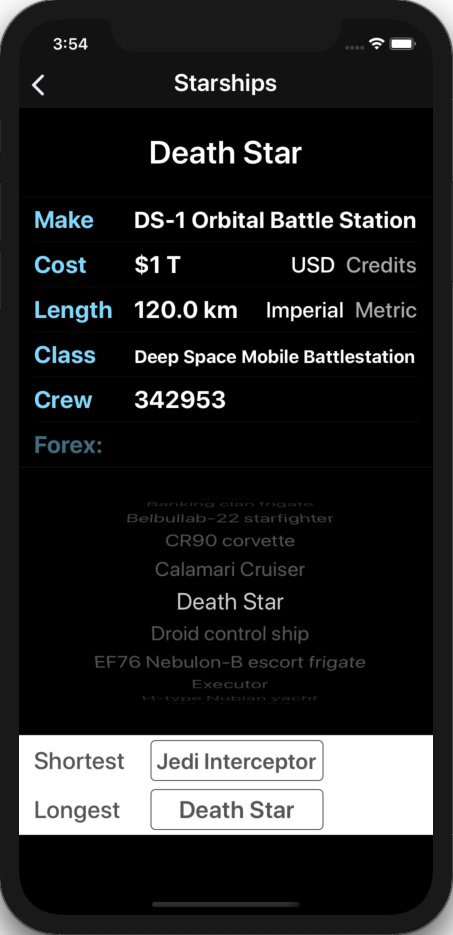

# Team Treehouse TechDegree Project 6

## The API Awakens App

**App Description:**  Star Wars Information App.  Allows the user to select a Star Wars character, vehicle or starship and retrieves and displays associated data using the Star Wars API.

**Swift Features Used:**
APIs, Asynchronous Networking, Generics, Concurrency, JSON decoding, Postman, Codable Protocol, Autolayout, Picker Views, Error Handling, Keyboard Control (UITextFieldDelegate), Segues, View Models. 

**Screenshots:**

